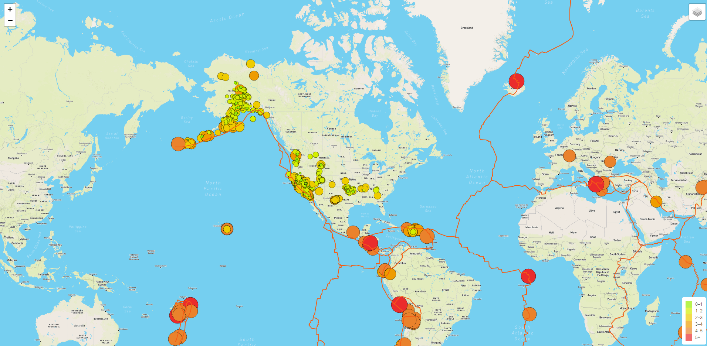
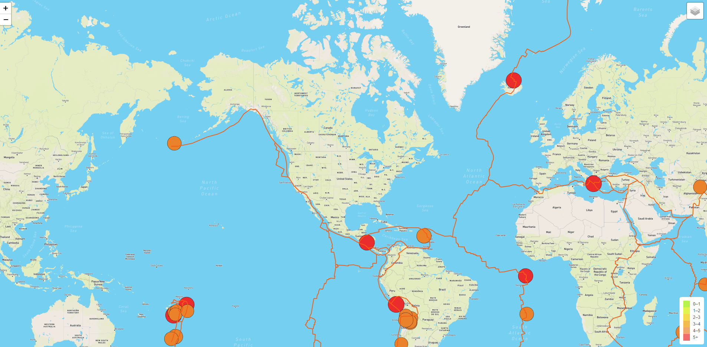
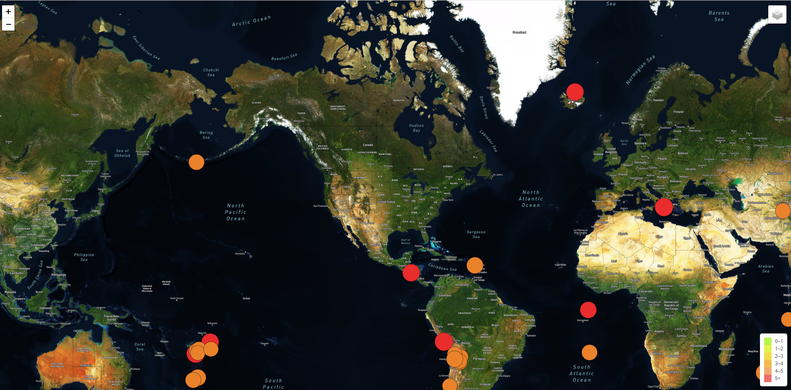
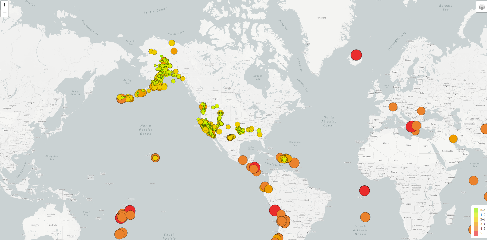

# Mapping_Earthquakes

The "Earthquake Challenge" folder in this repository provides code for a map showing earthquake data for the previous 7 days, using Mapbox and Leaflet. There are three different background options for the map. The circle markers showing the earthquakes differ in size and color based on magnitude. The user can toggle between displays of all earthquakes or major earthquakes only, and can also toggle lines showing the tectonic plates on and off.

## Examples

- "Street" Layout with All Earthquakes and Tectonic Plates (The Default View):

- "Street" Layout with Major Earthquakes and Tectonic Plates:

- "Satellite" Layout with Major Earthquakes and No Tectonic Plates:

- "Light" Layout with All Earthquakes and No Tectonic Plates:

